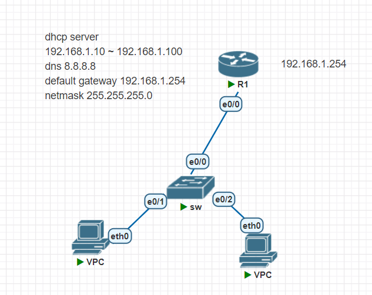

## Cisco 設備

新增 windows server 2008

把鏡像加到路徑 `/opt/unetlab/addons/qemu`


## DHCP 自動分配IP

## 配置圖



## Router
設定`hostname`  
進入特定接口，設定IP 啟動  
```
Router>enable
Router#conf t
Router(config)#hostname R1
R1(config)#int e0/0                           
R1(config-if)#ip addr 192.168.1.254 255.255.255.0
R1(config-if)#no shut
```
顯示介面  
```
R1#sh ip int brief
Interface              IP-Address      OK? Method Status                Protocol
Ethernet0/0            192.168.1.254   YES manual up                    up      
Ethernet0/1            unassigned      YES unset  administratively down down    
Ethernet0/2            unassigned      YES unset  administratively down down    
Ethernet0/3            unassigned      YES unset  administratively down down 
```
`do`：`config`中執行指令  
```
R1(config)#sh ip int brief   
               ^
% Invalid input detected at '^' marker.

R1(config)#do sh ip int brief
Interface              IP-Address      OK? Method Status                Protocol
Ethernet0/0            192.168.1.254   YES manual up                    up      
Ethernet0/1            unassigned      YES unset  administratively down down    
Ethernet0/2            unassigned      YES unset  administratively down down    
Ethernet0/3            unassigned      YES unset  administratively down down 
```
設定`dhcp server`  
```
R1(config)#ip dhcp pool pool1
R1(dhcp-config)#network 192.168.1.0 255.255.255.0
R1(dhcp-config)#default-router 192.168.1.254
R1(dhcp-config)#dns-server 8.8.8.8
```
設定可用`dhcp IP`  
```
R1(config)#ip dhcp excluded-address 192.168.1.1 192.168.1.9
R1(config)#ip dhcp excluded-address 192.168.1.101 192.168.1.254
```

## VPC
請求`dhcp ip`
```
VPCS> ip dhcp
DDORA IP 192.168.1.10/24 GW 192.168.1.254

VPCS> show ip

NAME        : VPCS[1]
IP/MASK     : 192.168.1.10/24
GATEWAY     : 192.168.1.254
DNS         : 8.8.8.8  
DHCP SERVER : 192.168.1.254
DHCP LEASE  : 86156, 86400/43200/75600
MAC         : 00:50:79:66:68:0f
LPORT       : 20000
RHOST:PORT  : 127.0.0.1:30000
MTU         : 1500
```

```
VPCS> ip dhcp
DDORA IP 192.168.1.11/24 GW 192.168.1.254

VPCS> show ip

NAME        : VPCS[1]
IP/MASK     : 192.168.1.11/24
GATEWAY     : 192.168.1.254
DNS         : 8.8.8.8  
DHCP SERVER : 192.168.1.254
DHCP LEASE  : 86390, 86400/43200/75600
MAC         : 00:50:79:66:68:10
LPORT       : 20000
RHOST:PORT  : 127.0.0.1:30000
MTU         : 1500
```
## DORA Protcol
查看目前配置  
```
R1#show running-config 
Building configuration...

Current configuration : 955 bytes
!
! Last configuration change at 13:25:25 UTC Mon Sep 19 2022
!
version 15.2
service timestamps debug datetime msec
service timestamps log datetime msec
!
hostname R1
!
boot-start-marker
boot-end-marker
!
!
!
no aaa new-model
!
!
ip dhcp excluded-address 192.168.1.254
ip dhcp excluded-address 192.168.1.1 192.168.1.9
ip dhcp excluded-address 192.168.1.101 192.168.1.253
!         
ip dhcp pool pool1
 network 192.168.1.0 255.255.255.0
 default-router 192.168.1.254 
 dns-server 8.8.8.8 
!         
!         
!         
ip cef    
no ipv6 cef
!         
!         
multilink bundle-name authenticated
!
!               
interface Ethernet0/0
 ip address 192.168.1.254 255.255.255.0
!         
interface Ethernet0/1
 no ip address
 shutdown 
!         
interface Ethernet0/2
 no ip address
 shutdown 
!         
interface Ethernet0/3
 no ip address
 shutdown 
!         
ip forward-protocol nd
!         
!         
no ip http server
!         
!         
control-plane
!         
!         
line con 0
 logging synchronous
line aux 0
line vty 0 4
 login    
!         
!         
!         
end 
```
將配置寫入，重開機後還會保存設定  
```
write memory
```