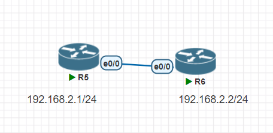

## lookback
`Loopback`為虛擬介面  
```
R1(config)#int lo 1
```
```
Router(config-if)#ip addr 1.2.3.4 255.255.255.0
Router(config-if)#do sh ip int brief           
Interface              IP-Address      OK? Method Status                Protocol
Ethernet0/0            unassigned      YES unset  administratively down down    
Ethernet0/1            unassigned      YES unset  administratively down down    
Ethernet0/2            unassigned      YES unset  administratively down down    
Ethernet0/3            unassigned      YES unset  administratively down down    
Loopback1              1.2.3.4         YES manual up                    up   
```
## telnet
## 配置圖

1. 設定ip  
```
Router>en
Router#conf t
Enter configuration commands, one per line.  End with CNTL/Z.
Router(config)#int e0/0
Router(config-if)#do ping 192.168.2.2 255.255.255.0
```
2. 設定Telnet連線密碼
```
R5(config)#line vty 0 4
R5(config-line)#password 123456
R5(config-line)#login
R5(config-line)#transport input telnet
exit
```
3. 進行連線
```
R6#telnet 192.168.2.1
Trying 192.168.2.1 ... Open

User Access Verification

Password:
R5>
```

## dhcp
```
R1(config)#int e0/1
R1(config-if)#ip addr dhcp
R1(config-if)#do sh ip int br
Interface              IP-Address      OK? Method Status                Protocol
Ethernet0/0            192.168.2.1     YES manual up                    up
Ethernet0/1            192.168.52.171  YES DHCP   up                    up
Ethernet0/2            unassigned      YES unset  administratively down down
Ethernet0/3            unassigned      YES unset  administratively down down
```

## ssh
1. 設定使用者密碼、加密方式  
```
R5(config)#username user password user
R5(config)#username cisco secr
R5(config)#usernaip domain-name test.com
                 ^
% Invalid input detected at '^' marker.

R5(config)#ip domain-name test.com
R5(config)#crypto key gener
R5(config)#crypto key generate rsa
The name for the keys will be: R5.test.com
Choose the size of the key modulus in the range of 360 to 4096 for your
  General Purpose Keys. Choosing a key modulus greater than 512 may take
  a few minutes.

How many bits in the modulus [512]: 1024
% Generating 1024 bit RSA keys, keys will be non-exportable...
[OK] (elapsed time was 0 seconds)

R5(config)#ip ssh version 2
R5(config)#line vty 0 4
R5(config-line)#login loca
R5(config-line)#login local
R5(config-line)#tra
R5(config-line)#transport inp
R5(config-line)#transport input ssh
```

```
R6#ssh -l 192.168.2.1
% Incomplete command.

R6#ssh -l user 192.168.2.1
Password:
```
## Ubuntu
加上net，可跟外網連線  

```
R5(config)#int e0/1
R5(config-if)#ip addr dhcp
R5(config-if)#do sh ip int br
Interface              IP-Address      OK? Method Status                Protocol
Ethernet0/0            192.168.2.1     YES manual up                    up
Ethernet0/1            192.168.153.135 YES DHCP   up                    up
Ethernet0/2            unassigned      YES unset  administratively down down
Ethernet0/3            unassigned      YES unset  administratively down down
```
```
root@ubuntu:/home/user/Desktop# ssh -oKexAlgorithms=+diffie-hellman-group1-sha1 -c aes256-cbc user@192.168.153.135
The authenticity of host '192.168.153.135 (192.168.153.135)' can't be established.
RSA key fingerprint is SHA256:xVRcQsLhjSeTIwqmcBOCHLHd845C+/xpYHeyzZy7eCo.
Are you sure you want to continue connecting (yes/no/[fingerprint])? yes
Warning: Permanently added '192.168.153.135' (RSA) to the list of known hosts.
Password: 

R5>
```