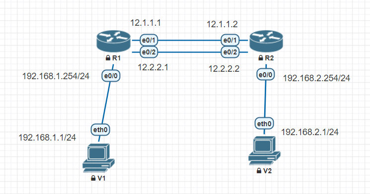

## 等價路由

查表在第三層  
## 快速轉發機制
Cisco Express Forwarding  
Cisco會紀錄過去的傳輸路線，把封包都由相同路線傳輸  
不會因為等價路由而平均傳送  

## 尋徑規則差別  
RIP -ECMP只考慮跳數  
OSPF -ECMP 有考慮頻寬  
EIGRP ---- not equal cost multipath routing  
考慮 bw, delay, reliability, cost, MTU  

## 配置圖

```
Router(config-router)#do sh ip rout
      12.0.0.0/8 is variably subnetted, 4 subnets, 2 masks
C        12.1.1.0/24 is directly connected, Ethernet0/1
L        12.1.1.1/32 is directly connected, Ethernet0/1
C        12.2.2.0/24 is directly connected, Ethernet0/2
L        12.2.2.1/32 is directly connected, Ethernet0/2
      192.168.1.0/24 is variably subnetted, 2 subnets, 2 masks
C        192.168.1.0/24 is directly connected, Ethernet0/0
L        192.168.1.254/32 is directly connected, Ethernet0/0
R     192.168.2.0/24 [120/1] via 12.2.2.2, 00:00:00, Ethernet0/2
                     [120/1] via 12.1.1.2, 00:00:02, Ethernet0/1
```
```
[120/1] via 12.1.1.2, 00:00:02, Ethernet0/1
[管理距離/成本]
```
## 戴克斯特拉演算法
[戴克斯特拉演算法](https://zh.wikipedia.org/wiki/%E6%88%B4%E5%85%8B%E6%96%AF%E7%89%B9%E6%8B%89%E7%AE%97%E6%B3%95)