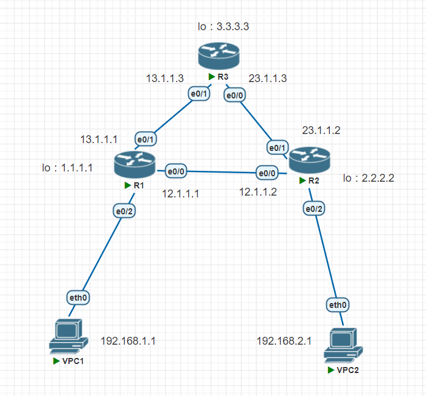

## 路由3表
neighbars
topology
routing
## 配置圖

## ospf
1. 設定ip
## R1
```
R1(config)#do sh ip int br
Interface              IP-Address      OK? Method Status                Protocol
Ethernet0/0            12.1.1.1        YES NVRAM  up                    up
Ethernet0/1            13.1.1.1        YES NVRAM  up                    up
Ethernet0/2            192.168.1.254   YES NVRAM  up                    up
Ethernet0/3            unassigned      YES NVRAM  administratively down down
Loopback1              1.1.1.1         YES NVRAM  up                    up

R1(config)#router ospf 100
R1(config-router)#network 12.1.1.0 0.0.0.255 area 0
R1(config-router)#network 13.1.1.0 0.0.0.255 area 0
R1(config-router)#network 1.1.1.0 0.0.0.255 a 0
R1(config-router)#network 192.168.1.0 0.0.0.255 a 0
```
## R2
```
config-if)#router ospf 100
Router(config-router)#network 12.1.1.0 0.0.0.255 area 0
*Oct 30 15:08:48.606: %OSPF-5-ADJCHG: Process 100, Nbr 1.1.1.1 on Ethernet0/0 from LOADING to FULL, Loading Done
Router(config-router)#network 23.1.1.0 0.0.0.255 area 0
Router(config-router)#network 2.2.2.0 0.0.0.255 a 0
Router(config-router)#network 192.168.2.0 0.0.0.255 area 0
```
## R3
```
Router(config-if)#router ospf 100
Router(config-router)#network 23.1.1.0 0.0.0.255 a 0
Router(config-router)#network 3.3.3.0 0.0.0.255 a 0
Router(config-router)#network 13.1.1.0 0.0.0.255 a 0
```
等待一下，查看有沒有學習路由規則  
```
Router(config-router)#do sh ip route
Codes: L - local, C - connected, S - static, R - RIP, M - mobile, B - BGP
       D - EIGRP, EX - EIGRP external, O - OSPF, IA - OSPF inter area
       N1 - OSPF NSSA external type 1, N2 - OSPF NSSA external type 2
       E1 - OSPF external type 1, E2 - OSPF external type 2
       i - IS-IS, su - IS-IS summary, L1 - IS-IS level-1, L2 - IS-IS level-2
       ia - IS-IS inter area, * - candidate default, U - per-user static route
       o - ODR, P - periodic downloaded static route, H - NHRP, l - LISP
       + - replicated route, % - next hop override

Gateway of last resort is not set

      1.0.0.0/32 is subnetted, 1 subnets
C        1.1.1.1 is directly connected, Loopback1
      2.0.0.0/32 is subnetted, 1 subnets
O        2.2.2.2 [110/11] via 12.1.1.2, 00:02:03, Ethernet0/0
      3.0.0.0/32 is subnetted, 1 subnets
O        3.3.3.3 [110/21] via 12.1.1.2, 00:02:13, Ethernet0/0
      12.0.0.0/8 is variably subnetted, 2 subnets, 2 masks
C        12.1.1.0/24 is directly connected, Ethernet0/0
L        12.1.1.1/32 is directly connected, Ethernet0/0
      13.0.0.0/8 is variably subnetted, 2 subnets, 2 masks
C        13.1.1.0/24 is directly connected, Ethernet0/1
L        13.1.1.1/32 is directly connected, Ethernet0/1
      23.0.0.0/24 is subnetted, 1 subnets
O        23.1.1.0 [110/20] via 12.1.1.2, 00:05:29, Ethernet0/0
```
```
R1(config)#do sh ip ospf database

            OSPF Router with ID (1.1.1.1) (Process ID 100)

                Router Link States (Area 0)

Link ID         ADV Router      Age         Seq#       Checksum Link count
1.1.1.1         1.1.1.1         566         0x80000008 0x005ACE 4
2.2.2.2         2.2.2.2         858         0x80000007 0x007A8A 4
3.3.3.3         3.3.3.3         326         0x80000005 0x00423B 3

                Net Link States (Area 0)

Link ID         ADV Router      Age         Seq#       Checksum
12.1.1.2        2.2.2.2         1139        0x80000003 0x000E06
13.1.1.1        1.1.1.1         566         0x80000001 0x006FA6
23.1.1.3        3.3.3.3         326         0x80000002 0x00AC50
```
`VPC1`是從`R1`-`R2`-`VPC2`  
```
VPCS> trace 192.168.2.1
trace to 192.168.2.1, 8 hops max, press Ctrl+C to stop
 1   192.168.1.254   0.902 ms  0.767 ms  0.650 ms
 2   12.1.1.2   1.557 ms  1.533 ms  1.414 ms
 3   *192.168.2.1   1.450 ms (ICMP type:3, code:3, Destination port unreachable
```
切斷`R1 eth0`後，`VPC1`會中斷一下，馬上找到新的路線  
```
VPCS> ping 192.168.2.1 -t

84 bytes from 192.168.2.1 icmp_seq=1 ttl=62 time=1.550 ms
84 bytes from 192.168.2.1 icmp_seq=2 ttl=62 time=1.508 ms
84 bytes from 192.168.2.1 icmp_seq=3 ttl=62 time=1.380 ms
84 bytes from 192.168.2.1 icmp_seq=4 ttl=62 time=1.212 ms
84 bytes from 192.168.2.1 icmp_seq=5 ttl=62 time=3.956 ms
84 bytes from 192.168.2.1 icmp_seq=6 ttl=62 time=1.627 ms
84 bytes from 192.168.2.1 icmp_seq=7 ttl=62 time=1.239 ms
192.168.2.1 icmp_seq=8 timeout
192.168.2.1 icmp_seq=9 timeout
192.168.2.1 icmp_seq=10 timeout
84 bytes from 192.168.2.1 icmp_seq=11 ttl=61 time=2.254 ms
84 bytes from 192.168.2.1 icmp_seq=12 ttl=61 time=2.136 ms
84 bytes from 192.168.2.1 icmp_seq=13 ttl=61 time=2.087 ms
84 bytes from 192.168.2.1 icmp_seq=14 ttl=61 time=1.808 ms
```
`VPC1`改從`R1`-`R3`-`R2`-`VPC2`  
```
VPCS> trace 192.168.2.1
trace to 192.168.2.1, 8 hops max, press Ctrl+C to stop
 1   192.168.1.254   0.695 ms  0.395 ms  0.385 ms
 2   13.1.1.3   0.751 ms  0.593 ms  0.659 ms
 3   23.1.1.2   1.099 ms  1.008 ms  1.347 ms
 4   *192.168.2.1   1.701 ms (ICMP type:3, code:3, Destination port unreachable)
```