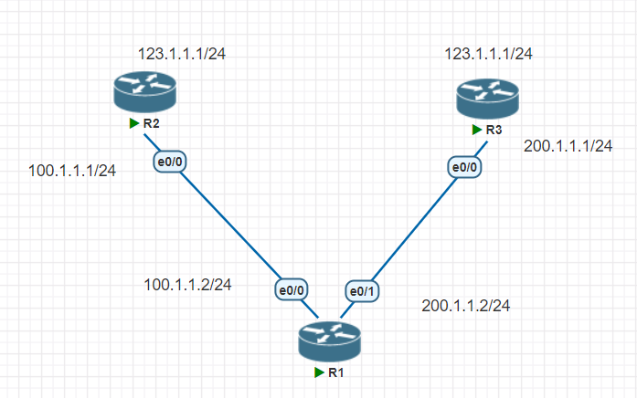
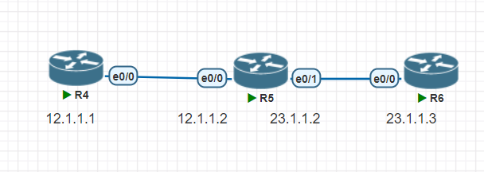

## 配置圖

## 浮動路由 
1. 設定ip

設定兩條路徑的成本  
兩邊能連動同ip時，會先選本低的
```
Router(config)#ip route 0.0.0.0 0.0.0.0 100.1.1.1
Router(config)#ip route 0.0.0.0 0.0.0.0 200.1.1.1 10
Router(config)#do traceroute 123.1.1.1
Type escape sequence to abort.
Tracing the route to 123.1.1.1
VRF info: (vrf in name/id, vrf out name/id)
  1 100.1.1.1 1 msec 1 msec *
```
2. 切斷後，會選擇另一條，稱為浮動路由  
```
Router(config)#int e0/0
Router(config-if)#shutdown
Router(config)#do traceroute 123.1.1.1
Type escape sequence to abort.
Tracing the route to 123.1.1.1
VRF info: (vrf in name/id, vrf out name/id)
  1 200.1.1.1 1 msec 1 msec 1 msec
  2 200.1.1.1 !H  !H  *
```
1. 如果從`R2`切斷，`R1`這端就不會切換路線  
```
R2(config-if)#
*Dec 31 16:08:34.040: %LINK-5-CHANGED: Interface Ethernet0/0, changed state to administratively down
*Dec 31 16:08:35.041: %LINEPROTO-5-UPDOWN: Line protocol on Interface Ethernet0/0, changed state to down
```
```
Router(config-if)#do traceroute 123.1.1.1
Type escape sequence to abort.
Tracing the route to 123.1.1.1
VRF info: (vrf in name/id, vrf out name/id)
  1  *  *  *
  2  *  *  *
  3  *  *  *
  4  *  *  *
  5  *  *  *
  6  *  *  *
  7  *
```
## 自動切換
1. 清除之前的路由規則
```
R1(config)#no ip route 0.0.0.0 0.0.0.0 100.1.1.1
R1(config)#no ip route 0.0.0.0 0.0.0.0 200.1.1.1 10
```
1. 設定定時`ping 100.1.1.1`  
從現在啟動，永久持續  
設定事件10，偵測可達性  
`ip route 0.0.0.0 0.0.0.0 100.1.1.1`綁定事件10  

```
R1(config-ip-sla)#icmp-echo 100.1.1.1
R1(config-ip-sla-echo)#frequency 3
%Error: frequency is less than timeout 5000 ms
R1(config-ip-sla-echo)#exit
R1(config)#ip sla schedule 1 life forever start-time now
R1(config)#track 10 ip sla 1 reachability
R1(config)#ip route 0.0.0.0 0.0.0.0 100.1.1.1 track 10
R1(config)#ip route 0.0.0.0 0.0.0.0 200.1.1.1 10
```
從`R2`切斷  
```
R2(config-if)#int e0/0
R2(config-if)#shutdown
```
`R1`會自動切換  
```
R1(config)#do traceroute 123.1.1.1
Type escape sequence to abort.
Tracing the route to 123.1.1.1
VRF info: (vrf in name/id, vrf out name/id)
  1  *  *  *
  2  *  *  *
  3  *  *  *
  4  *  *  *
  5  *  *  *
  6  *  *

*Dec 31 16:20:51.211: %TRACKING-5-STATE: 10 ip sla 1 reachability Up->Down200.1.1.1 !H
```
## 配置圖

## EIGRP

```
R4(config)#router eigrp ?
  <1-65535>  Autonomous System
  WORD       EIGRP Virtual-Instance Name
```
設定`eigrp 10`  
禁用網路合併  
```
R4(config)#router eigrp 10
R4(config-router)#no auto-summary
R4(config-router)#network 12.1.1.0 0.0.0.255
```
```
R5(config)#router eigrp 10
R5(config-router)#no auto-summary
R5(config-router)#network 12.1.1.0 0.0.0.255
*Dec 31 16:48:24.024: %DUAL-5-NBRCHANGE: EIGRP-IPv4 10: Neighbor 12.1.1.1 (Ethernet0/0) is up: new adjacency
R5(config-router)#network 23.1.1.0 0.0.0.255
```
```
R6(config)#router eigrp 10
R6(config-router)#no auto-summary
R6(config-router)#network 23.1.1.0
```
`R4`就會學到其他的規則  
```
R4(config-router)#do sh ip route
Codes: L - local, C - connected, S - static, R - RIP, M - mobile, B - BGP
       D - EIGRP, EX - EIGRP external, O - OSPF, IA - OSPF inter area
       N1 - OSPF NSSA external type 1, N2 - OSPF NSSA external type 2
       E1 - OSPF external type 1, E2 - OSPF external type 2
       i - IS-IS, su - IS-IS summary, L1 - IS-IS level-1, L2 - IS-IS level-2
       ia - IS-IS inter area, * - candidate default, U - per-user static route
       o - ODR, P - periodic downloaded static route, H - NHRP, l - LISP
       + - replicated route, % - next hop override

Gateway of last resort is not set

      12.0.0.0/8 is variably subnetted, 2 subnets, 2 masks
C        12.1.1.0/24 is directly connected, Ethernet0/0
L        12.1.1.1/32 is directly connected, Ethernet0/0
      23.0.0.0/24 is subnetted, 1 subnets
D        23.1.1.0 [90/307200] via 12.1.1.2, 00:01:23, Ethernet0/
```

`Hold Uptime`：傳送封包倒數，到0都沒有收到回應，就會認為路線出錯  
```
R4(config)#do sh ip eigrp neighbors
EIGRP-IPv4 Neighbors for AS(10)
H   Address                 Interface              Hold Uptime   SRTT   RTO  Q  Seq
                                                   (sec)         (ms)       Cnt Num
0   12.1.1.2                Et0/0                    12 00:03:20    3   100  0  3
```
eigrp的路線表  
`(307200/281600)`：(FD/AD)=(R4-R5e0/1 / R5-R5r0/1)  
```
R4(config)#do sh ip eigrp topology detail-links
EIGRP-IPv4 Topology Table for AS(10)/ID(12.1.1.1)
Codes: P - Passive, A - Active, U - Update, Q - Query, R - Reply,
       r - reply Status, s - sia Status

P 23.1.1.0/24, 1 successors, FD is 307200, serno 2
        via 12.1.1.2 (307200/281600), Ethernet0/0
P 12.1.1.0/24, 1 successors, FD is 281600, serno 1
        via Connected, Ethernet0/0
```

## 頻寬計算
一條路徑中最小的值計算  
```
Metric = [K1 * Bandwidth + (K2 * Bandwidth) / (256 - Load)] + K3 * Delay
```