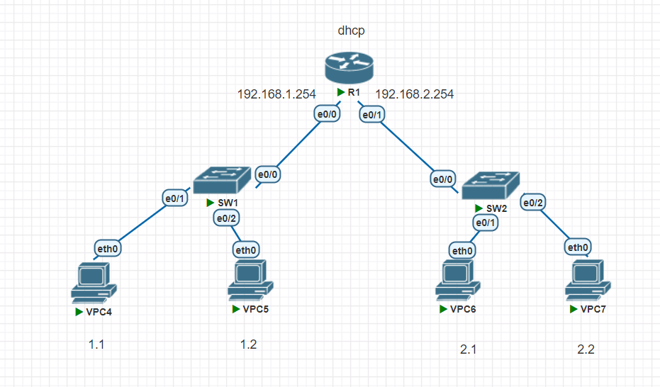
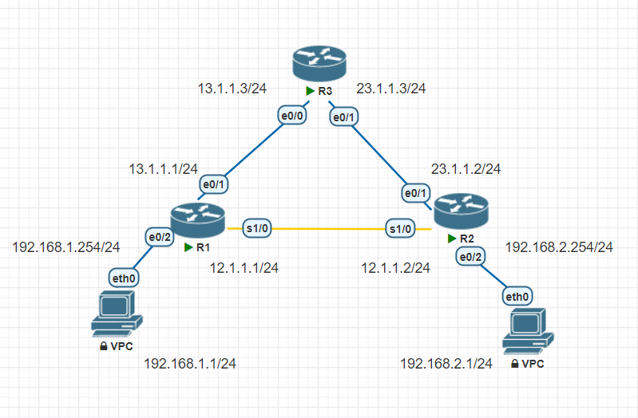

## 1.DHCP

1. 設定`router ip`跟`dhcp pool`，
```
Router>en
Router#conf t
Router(config)#int e0/0
Router(config-if)#ip addr 192.168.1.254 255.255.255.0
Router(config-if)#no shutdown
Router(config-if)#ip dhcp pool pool1
Router(dhcp-config)#network 192.168.1.0 255.255.255.0
Router(dhcp-config)#default-ro
Router(dhcp-config)#default-router 192.168.1.254
Router(dhcp-config)#dns-ser
Router(dhcp-config)#dns-server 8.8.8.8
Router(config)#ip dhcp excluded-address 192.168.1.101 192.168.1.254
```
```
Router(config)#int e0/1
Router(config-if)#ip addr 192.168.2.254 255.255.255.0
Router(config-if)#no shutdown
Router(config-if)#ip dhcp pool pool1
Router(dhcp-config)#network 192.168.2.0 255.255.255.0
Router(dhcp-config)#default-router 192.168.2.254
Router(dhcp-config)#dns-server
Router(dhcp-config)#dns-server 8.8.8.8
Router(dhcp-config)#exit
Router(config)#ip dhcp excluded-address 192.168.2.101 192.168.2.254
```
請求`ip`  
```
VPCS> ip dhcp
DDORA IP 192.168.1.1/24 GW 192.168.1.254
```
```
VPCS> ip dhcp
DDORA IP 192.168.1.2/24 GW 192.168.1.254
```

```
VPCS> ip dhcp
DDORA IP 192.168.2.1/24 GW 192.168.2.254

VPCS> ping 192.168.1.1

84 bytes from 192.168.1.1 icmp_seq=1 ttl=63 time=4.056 ms
84 bytes from 192.168.1.1 icmp_seq=2 ttl=63 time=1.783 ms
84 bytes from 192.168.1.1 icmp_seq=3 ttl=63 time=2.255 ms
84 bytes from 192.168.1.1 icmp_seq=4 ttl=63 time=2.154 ms
^C
VPCS> trace 192.168.1.1
trace to 192.168.1.1, 8 hops max, press Ctrl+C to stop
 1   192.168.2.254   1.311 ms  1.429 ms  1.282 ms
 2   *192.168.1.1   2.645 ms (ICMP type:3, code:3, Destination port unreachable)

VPCS> ping 192.168.2.2

84 bytes from 192.168.2.2 icmp_seq=1 ttl=64 time=1.011 ms
84 bytes from 192.168.2.2 icmp_seq=2 ttl=64 time=0.995 ms
^C
```
## 2

## RIP

```
R1(config-if)#int e0/1
R1(config-if)#ip addr 13.1.1.1 255.255.255.0
R1(config-if)#no shutdown
R1(config-if)#int e0/2
R1(config-if)#ip addr 192.168.1.254 255.255.255.0
R1(config-if)#no shutdown
R1(config-if)#int s1/0
R1(config-if)#ip addr 12.1.1.1 255.255.255.0
R1(config-if)#no shutdown
R1(config-if)#do sh ip int br
Interface              IP-Address      OK? Method Status                Protocol
Ethernet0/0            unassigned      YES unset  administratively down down
Ethernet0/1            13.1.1.1        YES manual up                    up
Ethernet0/2            192.168.1.254   YES manual up                    up
Ethernet0/3            unassigned      YES unset  administratively down down
Serial1/0              12.1.1.1        YES manual up                    down
Serial1/1              unassigned      YES unset  administratively down down
Serial1/2              unassigned      YES unset  administratively down down
Serial1/3              unassigned      YES unset  administratively down down
```
```
R2(config)#int e0/2
R2(config-if)#ip addr 192.168.2.254 255.255.255.0
R2(config-if)#no shutdown
R2(config-if)#int e0/1
R2(config-if)#ip addr 23.1.1.2 255.255.255.0
R2(config-if)#no shutdown
R2(config-if)#int s1/0
R2(config-if)#ip addr 12.1.1.2 255.255.255.0
R2(config-if)#no shutdown
R2(config-if)#do ping 12.1.1.1
R2(config-if)#do sh ip int br
Interface              IP-Address      OK? Method Status                Protocol
Ethernet0/0            unassigned      YES unset  administratively down down
Ethernet0/1            23.1.1.2        YES manual up                    up
Ethernet0/2            192.168.2.254   YES manual up                    up
Ethernet0/3            unassigned      YES unset  administratively down down
Serial1/0              12.1.1.2        YES manual up                    up
Serial1/1              unassigned      YES unset  administratively down down
Serial1/2              unassigned      YES unset  administratively down down
Serial1/3              unassigned      YES unset  administratively down down
```
```
Router(config)#int e0/0
Router(config-if)#ip addr 13.1.1.3 255.255.255.0
Router(config-if)#no shutdown
Router(config-if)#int e0/1
Router(config-if)#no shutdown
Router(config-if)#ip addr 23.1.1.3 255.255.255.0
Router(config-if)#no shutdown
Router(config-if)#do sh ip int br
Interface              IP-Address      OK? Method Status                Protocol
Ethernet0/0            13.1.1.3        YES manual up                    up
Ethernet0/1            23.1.1.3        YES manual up                    up
Ethernet0/2            unassigned      YES unset  administratively down down
Ethernet0/3            unassigned      YES unset  administratively down down
```
```
R1(config)#router rip
R1(config-router)#version 2
R1(config-router)#no auto-summary
R1(config-router)#network 12.1.1.0
R1(config-router)#network 13.1.1.0
R1(config-router)#network 192.168.1.0
```
```
R2(config)#router rip
R2(config-router)#version 2
R2(config-router)#no auto-summary
R2(config-router)#network 12.1.1.0
R2(config-router)#network 23.1.1.0
R2(config-router)#network 192.168.2.0
```
```
Router(config)#router rip
Router(config-router)#no auto-summary
Router(config-router)#network 13.1.1.0
Router(config-router)#network 23.1.1.0
```
```
VPCS> ping 192.168.2.254

84 bytes from 192.168.2.254 icmp_seq=1 ttl=254 time=22.142 ms
84 bytes from 192.168.2.254 icmp_seq=2 ttl=254 time=21.572 ms
84 bytes from 192.168.2.254 icmp_seq=3 ttl=254 time=22.200 ms
84 bytes from 192.168.2.254 icmp_seq=4 ttl=254 time=22.042 ms
84 bytes from 192.168.2.254 icmp_seq=5 ttl=254 time=22.200 ms

VPCS> ping 192.168.2.1

84 bytes from 192.168.2.1 icmp_seq=1 ttl=62 time=24.090 ms
84 bytes from 192.168.2.1 icmp_seq=2 ttl=62 time=23.288 ms
84 bytes from 192.168.2.1 icmp_seq=3 ttl=62 time=22.196 ms
84 bytes from 192.168.2.1 icmp_seq=4 ttl=62 time=23.916 ms
84 bytes from 192.168.2.1 icmp_seq=5 ttl=62 time=22.314 ms

VPCS> ping 13.1.1.3

84 bytes from 13.1.1.3 icmp_seq=1 ttl=254 time=1.576 ms
84 bytes from 13.1.1.3 icmp_seq=2 ttl=254 time=1.005 ms
84 bytes from 13.1.1.3 icmp_seq=3 ttl=254 time=1.382 ms
84 bytes from 13.1.1.3 icmp_seq=4 ttl=254 time=1.506 ms
84 bytes from 13.1.1.3 icmp_seq=5 ttl=254 time=1.500 ms

VPCS> trace 192.168.2.1
trace to 192.168.2.1, 8 hops max, press Ctrl+C to stop
 1   192.168.1.254   0.602 ms  0.506 ms  0.607 ms
 2   12.1.1.2   22.275 ms  23.510 ms  22.080 ms
 3   *192.168.2.1   24.581 ms (ICMP type:3, code:3, Destination port unreachable)
```

## ospf
```
R1(config)#router ospf 1
R1(config-router)#router ospf 1
R1(config-router)#network 192.168.1.0 0.0.0.255 a 0
R1(config-router)#network 12.1.1.0 0.0.0.255 a 0
R1(config-router)#network 13.1.1.0 0.0.0.255 a 0
```
```
R2(config)#router ospf 1
R2(config-router)#network 12.1.1.0 0.0.0.255 a 0
R2(config-router)#network 23.1.1.0 0.0.0.255 a 0
R2(config-router)#network 192.168.2.0 0.0.0.255 a 0
```
```
Router(config)#router ospf 1
Router(config-router)#network 13.1.1.0 0.0.0.255 a 0
Router(config-router)#network 13.1.1.0 0.0.0.255 a 0
```
```
VPCS> trace 192.168.2.1
trace to 192.168.2.1, 8 hops max, press Ctrl+C to stop
 1   192.168.1.254   0.958 ms  0.654 ms  0.817 ms
 2   13.1.1.3   1.116 ms  1.189 ms  1.120 ms
 3   23.1.1.2   1.660 ms  2.245 ms  1.919 ms
 4   *192.168.2.1   3.845 ms (ICMP type:3, code:3, Destination port unreachable)

VPCS> ping 13.1.1.3

84 bytes from 13.1.1.3 icmp_seq=1 ttl=254 time=0.984 ms
84 bytes from 13.1.1.3 icmp_seq=2 ttl=254 time=1.156 ms
84 bytes from 13.1.1.3 icmp_seq=3 ttl=254 time=3.112 ms
84 bytes from 13.1.1.3 icmp_seq=4 ttl=254 time=1.468 ms
84 bytes from 13.1.1.3 icmp_seq=5 ttl=254 time=1.147 ms

VPCS> ping 23.1.1.3

84 bytes from 23.1.1.3 icmp_seq=1 ttl=254 time=1.534 ms
84 bytes from 23.1.1.3 icmp_seq=2 ttl=254 time=1.085 ms
84 bytes from 23.1.1.3 icmp_seq=3 ttl=254 time=1.212 ms
84 bytes from 23.1.1.3 icmp_seq=4 ttl=254 time=1.377 ms
84 bytes from 23.1.1.3 icmp_seq=5 ttl=254 time=1.001 ms
```
## EIGRP

```
R1(config)#router eigrp 10
R1(config-router)#no auto-summary
R1(config-router)#network 192.168.1.0 0.0.0.255
R1(config-router)#network 12.1.1.0 0.0.0.255
R1(config-router)#network 13.1.1.0 0.0.0.255
```
```
R2(config-router)#no auto-summary
R2(config-router)#network 192.168.2.0 0.0.0.255
R2(config-router)#network 12.1.1.0 0.0.0.255
R2(config-router)#network 23.1.1.0 0.0.0.255
```
```
Router(config)#router eigrp 10
Router(config-router)#no auto-summary
Router(config-router)#network 13.1.1.0 0.0.0.255
Router(config-router)#network 23.1.1.0 0.0.0.255
```
```
VPCS> trace 192.168.2.1
trace to 192.168.2.1, 8 hops max, press Ctrl+C to stop
 1   192.168.1.254   0.543 ms  0.930 ms  0.616 ms
 2   12.1.1.2   22.416 ms  22.399 ms  22.307 ms
 3   *192.168.2.1   27.358 ms (ICMP type:3, code:3, Destination port unreachable)
```

## 3.ECMP

```

```