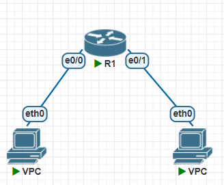
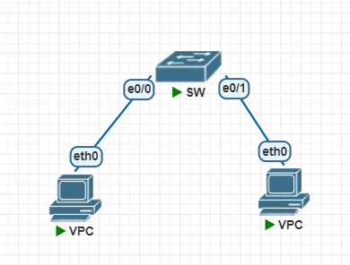
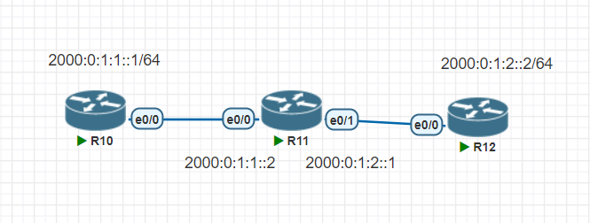

# ipv6
  
手動設定`ipv6`  
```
Router(config)#ipv6 unicast-routing
Router(config)#int e0/0
Router(config-if)#ipv6 enable
Router(config-if)#ipv6 addr 2000:0:1:1::1/64
Router(config-if)#no shut
Router(config-if)#int e0/1
Router(config-if)#ipv6 enable
Router(config-if)#ipv6 addr 2000:0:1:2::1/64
Router(config-if)#no shut
```
```
VPCS> ip 2000:0:1:1::2/64 2000:0:1:1::1
PC1 : 2000:0:1:1::2/64

VPCS> show ipv6

NAME              : VPCS[1]
LINK-LOCAL SCOPE  : fe80::250:79ff:fe66:6842/64
GLOBAL SCOPE      : 2000:0:1:1::2/64
DNS               :
ROUTER LINK-LAYER : aa:bb:cc:00:01:00
MAC               : 00:50:79:66:68:42
LPORT             : 20000
RHOST:PORT        : 127.0.0.1:30000
MTU:              : 1500
```
```
VPCS> ip 2000:0:1:2::2/64 2000:0:1:2::1
PC1 : 2000:0:1:2::2/64

VPCS> show ipv6

NAME              : VPCS[1]
LINK-LOCAL SCOPE  : fe80::250:79ff:fe66:6843/64
GLOBAL SCOPE      : 2000:0:1:2::2/64
DNS               :
ROUTER LINK-LAYER : aa:bb:cc:00:01:10
MAC               : 00:50:79:66:68:43
LPORT             : 20000
RHOST:PORT        : 127.0.0.1:30000
MTU:              : 1500

```
```
VPCS> ping 2000:0:1:1::2

2000:0:1:1::2 icmp_seq=1 ttl=64 time=0.001 ms
2000:0:1:1::2 icmp_seq=2 ttl=64 time=0.001 ms
2000:0:1:1::2 icmp_seq=3 ttl=64 time=0.001 ms
2000:0:1:1::2 icmp_seq=4 ttl=64 time=0.001 ms
2000:0:1:1::2 icmp_seq=5 ttl=64 time=0.001 ms

VPCS> ping 2000:0:1:2::2

2000:0:1:2::2 icmp6_seq=1 ttl=62 time=6.757 ms
2000:0:1:2::2 icmp6_seq=2 ttl=62 time=1.155 ms
2000:0:1:2::2 icmp6_seq=3 ttl=62 time=1.956 ms
2000:0:1:2::2 icmp6_seq=4 ttl=62 time=1.007 ms
2000:0:1:2::2 icmp6_seq=5 ttl=62 time=0.958 ms
```
## ip auto
```
VPCS> ip auto
GLOBAL SCOPE      : 2000:0:1:1:2050:79ff:fe66:6842/64
ROUTER LINK-LAYER : aa:bb:cc:00:01:00

VPCS> show ipv6

NAME              : VPCS[1]
LINK-LOCAL SCOPE  : fe80::250:79ff:fe66:6842/64
GLOBAL SCOPE      : 2000:0:1:1:2050:79ff:fe66:6842/64
DNS               :
ROUTER LINK-LAYER : aa:bb:cc:00:01:00
MAC               : 00:50:79:66:68:42
LPORT             : 20000
RHOST:PORT        : 127.0.0.1:30000
MTU:              : 1500
```
```
VPCS> ip auto
GLOBAL SCOPE      : 2000:0:1:2:2050:79ff:fe66:6843/64
ROUTER LINK-LAYER : aa:bb:cc:00:01:10

VPCS> show ipv6

NAME              : VPCS[1]
LINK-LOCAL SCOPE  : fe80::250:79ff:fe66:6843/64
GLOBAL SCOPE      : 2000:0:1:2:2050:79ff:fe66:6843/64
DNS               :
ROUTER LINK-LAYER : aa:bb:cc:00:01:10
MAC               : 00:50:79:66:68:43
LPORT             : 20000
RHOST:PORT        : 127.0.0.1:30000
MTU:              : 1500
```
## eui64
1. 取得`mac sddress`  
> 00:50:79:66:68:42
2. 從中間切半
> 00:50:79 66:68:42
3. 放入`fffe`  
> 00:50:79fffe66:68:42
4. 把冒號去掉，然後每四個字母以冒號分開來  
> 0050 79ff fe66 6842
5. 第7個bit作補數運算   
> 0250 79ff fe66 6842
6. 加入fe80
> fe80:0250:79ff:fe66:6842

## no-switchport
  
把`switch`當作`router`  
```
Switch(config)#ipv6 unicast-routing
Switch(config)#int e0/0
Switch(config-if)#no switchport
Switch(config-if)#ipv6 enable
Switch(config-if)#ipv6 addr 2000:0:1:3::1/64
Switch(config-if)#no shutdown
Switch(config-if)#ipv6 nd other-config-flag
Switch(config-if)#int e0/1
Switch(config-if)#no switchport
Switch(config-if)#ipv6 enable
Switch(config-if)#ipv6 addr 2000:0:1:4::1/64
Switch(config-if)#no shutdown
Switch(config-if)#ipv6 nd other-config-flag
```
達到跟`router`一樣的效果  
```
VPCS> ip auto
GLOBAL SCOPE      : 2000:0:1:3:2050:79ff:fe66:6845/64
ROUTER LINK-LAYER : aa:bb:cc:00:02:00

VPCS> sh ipv6

NAME              : VPCS[1]
LINK-LOCAL SCOPE  : fe80::250:79ff:fe66:6845/64
GLOBAL SCOPE      : 2000:0:1:3:2050:79ff:fe66:6845/64
DNS               :
ROUTER LINK-LAYER : aa:bb:cc:00:02:00
MAC               : 00:50:79:66:68:45
LPORT             : 20000
RHOST:PORT        : 127.0.0.1:30000
MTU:              : 1500
```

```
VPCS> ip auto
GLOBAL SCOPE      : 2000:0:1:4:2050:79ff:fe66:6846/64
ROUTER LINK-LAYER : aa:bb:cc:00:02:10

VPCS> show ip

NAME        : VPCS[1]
IP/MASK     : 0.0.0.0/0
GATEWAY     : 0.0.0.0
DNS         :
MAC         : 00:50:79:66:68:46
LPORT       : 20000
RHOST:PORT  : 127.0.0.1:30000
MTU         : 1500
```
```
VPCS> ping 2000:0:1:4:2050:79ff:fe66:6846

2000:0:1:4:2050:79ff:fe66:6846 icmp6_seq=1 ttl=62 time=22.959 ms
2000:0:1:4:2050:79ff:fe66:6846 icmp6_seq=2 ttl=62 time=0.883 ms
2000:0:1:4:2050:79ff:fe66:6846 icmp6_seq=3 ttl=62 time=1.090 ms
2000:0:1:4:2050:79ff:fe66:6846 icmp6_seq=4 ttl=62 time=1.144 ms
2000:0:1:4:2050:79ff:fe66:6846 icmp6_seq=5 ttl=62 time=1.270 ms

VPCS> ping 2000:0:1:3:2050:79ff:fe66:6845

2000:0:1:3:2050:79ff:fe66:6845 icmp_seq=1 ttl=64 time=0.001 ms
2000:0:1:3:2050:79ff:fe66:6845 icmp_seq=2 ttl=64 time=0.001 ms
2000:0:1:3:2050:79ff:fe66:6845 icmp_seq=3 ttl=64 time=0.001 ms
2000:0:1:3:2050:79ff:fe66:6845 icmp_seq=4 ttl=64 time=0.001 ms
2000:0:1:3:2050:79ff:fe66:6845 icmp_seq=5 ttl=64 time=0.001 ms
```
## ipv6 dhcp

```
R1(config)#ipv6 unicast-routing
R1(config)#ipv6 dhcp pool PD1
R1(config-dhcpv6)#address prefix 2000:0:1::/48
R1(config-dhcpv6)#dns-server 2000:0:1::2
R1(config-dhcpv6)#domain-name test.com
R1(config-dhcpv6)#exit

R1(config)#int e0/0
R1(config-if)#int e0/1
R1(config-if)#ipv6 enable
R1(config-if)#ipv6 addr 2000:0:1::1/48
R1(config-if)#ipv6 dhcp server PD1
R1(config-if)#no shutdown
```
```
VPCS> ping 2000:0:1::1

2000:0:1::1 icmp6_seq=1 ttl=64 time=1.395 ms
2000:0:1::1 icmp6_seq=2 ttl=64 time=1.745 ms
2000:0:1::1 icmp6_seq=3 ttl=64 time=1.157 ms
2000:0:1::1 icmp6_seq=4 ttl=64 time=0.784 ms
2000:0:1::1 icmp6_seq=5 ttl=64 time=0.920 ms
```

## ipv6 靜態路由

  
1. 設定好ip  
```
R1(config)#ipv6 unicast-routing
R1(config)#int e0/0
R1(config-if)#ipv6 enable
R1(config-if)#ipv6 addr 2000:0:1:1::1/64
R1(config-if)#no shutdown
```
```
R2(config)#ipv6 unicast-routing
R2(config)#int e0/0
R2(config-if)#ipv6 enable
R2(config-if)#ipv6 addr 2000:0:1:1::2/64
R2(config-if)#no shutdown
R2(config-if)#int e0/1
R2(config-if)#ipv6 enable
R2(config-if)#ipv6 addr 2000:0:1:2::2/64
R2(config-if)#no shutdown
```
```
R3(config)#ipv6 unicast-routing
R3(config)#int e0/0
R3(config-if)#ipv6 enable
R3(config-if)#ipv6 addr 2000:0:1:2::3/64
R3(config-if)#no shutdown
```
2. 確認能`ping`
```
Router(config-if)#do ping 2000:0:1:1::2
Type escape sequence to abort.
Sending 5, 100-byte ICMP Echos to 2000:0:1:1::2, timeout is 2 seconds:
!!!!!
Success rate is 100 percent (5/5), round-trip min/avg/max = 1/1/1 ms
Router(config-if)#do ping 2000:0:1:2::3
Type escape sequence to abort.
Sending 5, 100-byte ICMP Echos to 2000:0:1:2::3, timeout is 2 seconds:

% No valid route for destination
Success rate is 0 percent (0/1)
```
```
Router(config-if)#do ping 2000:0:1:2::3
Type escape sequence to abort.
Sending 5, 100-byte ICMP Echos to 2000:0:1:2::3, timeout is 2 seconds:
!!!!!
Success rate is 100 percent (5/5), round-trip min/avg/max = 1/1/1 ms
Router(config-if)#do ping  2000:0:1:1::2
Type escape sequence to abort.
Sending 5, 100-byte ICMP Echos to 2000:0:1:1::2, timeout is 2 seconds:
!!!!!
Success rate is 100 percent (5/5), round-trip min/avg/max = 1/1/1 ms
```
3. 設定路由規則  
```
R1(config)#ipv6 route 2000:0:1:2::/64 2000:0:1:1::2
```
```
R1(config)#do sh ipv6 route
IPv6 Routing Table - default - 4 entries
Codes: C - Connected, L - Local, S - Static, U - Per-user Static route
       B - BGP, R - RIP, H - NHRP, I1 - ISIS L1
       I2 - ISIS L2, IA - ISIS interarea, IS - ISIS summary, D - EIGRP
       EX - EIGRP external, ND - ND Default, NDp - ND Prefix, DCE - Destination
       NDr - Redirect, O - OSPF Intra, OI - OSPF Inter, OE1 - OSPF ext 1
       OE2 - OSPF ext 2, ON1 - OSPF NSSA ext 1, ON2 - OSPF NSSA ext 2, l - LISP
C   2000:0:1:1::/64 [0/0]
     via Ethernet0/0, directly connected
L   2000:0:1:1::1/128 [0/0]
     via Ethernet0/0, receive
S   2000:0:1:2::/64 [1/0]
     via 2000:0:1:1::2
L   FF00::/8 [0/0]
     via Null0, receive
```
```
R3(config)#ipv6 route 2000:0:1:1::/64 2000:0:1:2::2
```
```
R3(config)#do sh ipv6 route
IPv6 Routing Table - default - 4 entries
Codes: C - Connected, L - Local, S - Static, U - Per-user Static route
       B - BGP, R - RIP, H - NHRP, I1 - ISIS L1
       I2 - ISIS L2, IA - ISIS interarea, IS - ISIS summary, D - EIGRP
       EX - EIGRP external, ND - ND Default, NDp - ND Prefix, DCE - Destination
       NDr - Redirect, O - OSPF Intra, OI - OSPF Inter, OE1 - OSPF ext 1
       OE2 - OSPF ext 2, ON1 - OSPF NSSA ext 1, ON2 - OSPF NSSA ext 2, l - LISP
S   2000:0:1:1::/64 [1/0]
     via 2000:0:1:2::2
C   2000:0:1:2::/64 [0/0]
     via Ethernet0/0, directly connected
L   2000:0:1:2::3/128 [0/0]
     via Ethernet0/0, receive
L   FF00::/8 [0/0]
     via Null0, receive
```
4. `ping `
```
R1(config)#do ping 2000:0:1:2::2
Type escape sequence to abort.
Sending 5, 100-byte ICMP Echos to 2000:0:1:2::2, timeout is 2 seconds:
!!!!!
Success rate is 100 percent (5/5), round-trip min/avg/max = 1/1/1 ms
```
```
R3(config)#do ping 2000:0:1:1::1
Type escape sequence to abort.
Sending 5, 100-byte ICMP Echos to 2000:0:1:1::1, timeout is 2 seconds:
!!!!!
Success rate is 100 percent (5/5), round-trip min/avg/max = 1/1/2 ms
```

## ipv6 動態路由
配置與上面一樣，去掉靜態路由
```
R1(config)#ipv6 router ospf 1
R1(config-rtr)#router-id 1.1.1.1
R1(config-rtr)#int e0/0
R1(config-if)#ipv6 ospf 1 area 0
```
```
R2(config)#ipv6 router ospf 1
R2(config-rtr)#
*Jan  1 08:57:53.650: %OSPFv3-4-NORTRID: Process OSPFv3-1-IPv6 could not pick a router-id, please configure manually
R2(config-rtr)#router-id 2.2.2.2
R2(config-rtr)#int e0/0
R2(config-if)#ipv6 ospf 1 area 0
R2(config-if)#int e0/
*Jan  1 08:58:24.269: %OSPFv3-5-ADJCHG: Process 1, Nbr 1.1.1.1 on Ethernet0/0 from LOADING to FULL, Loading Done
R2(config-if)#int e0/1
R2(config-if)#ipv6 ospf 1 area 0
```
```
R3(config)#ipv6 router ospf 1
R3(config-rtr)#
*Jan  1 08:59:20.137: %OSPFv3-4-NORTRID: Process OSPFv3-1-IPv6 could not pick a router-id, please configure manually
R3(config-rtr)#router-id 3.3.3.3
R3(config-rtr)#int e0/0
R3(config-if)#ipv6 ospf 1 area 0
```

確認路由規則  
```
R1(config-if)#do sh ipv6 route
IPv6 Routing Table - default - 4 entries
Codes: C - Connected, L - Local, S - Static, U - Per-user Static route
       B - BGP, R - RIP, H - NHRP, I1 - ISIS L1
       I2 - ISIS L2, IA - ISIS interarea, IS - ISIS summary, D - EIGRP
       EX - EIGRP external, ND - ND Default, NDp - ND Prefix, DCE - Destination
       NDr - Redirect, O - OSPF Intra, OI - OSPF Inter, OE1 - OSPF ext 1
       OE2 - OSPF ext 2, ON1 - OSPF NSSA ext 1, ON2 - OSPF NSSA ext 2, l - LISP
C   2000:0:1:1::/64 [0/0]
     via Ethernet0/0, directly connected
L   2000:0:1:1::1/128 [0/0]
     via Ethernet0/0, receive
O   2000:0:1:2::/64 [110/20]
     via FE80::A8BB:CCFF:FE00:400, Ethernet0/0
L   FF00::/8 [0/0]
     via Null0, receive
R1(config)#do ping 2000:0:1:2::2
Type escape sequence to abort.
Sending 5, 100-byte ICMP Echos to 2000:0:1:2::2, timeout is 2 seconds:
!!!!!
Success rate is 100 percent (5/5), round-trip min/avg/max = 1/1/1 ms
```

`FE80::A8BB:CCFF:FE00:300`：下一跳的位置，手動生成的`link local`，位置不變  
```
R1(config)#do sh ipv6 int br
Ethernet0/0            [up/up]
    FE80::A8BB:CCFF:FE00:300
    2000:0:1:1::1
Ethernet0/1            [administratively down/down]
    unassigned
Ethernet0/2            [administratively down/down]
    unassigned
Ethernet0/3            [administratively down/down]
    unassigned
```