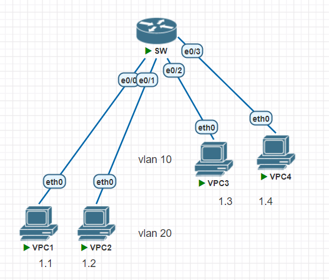
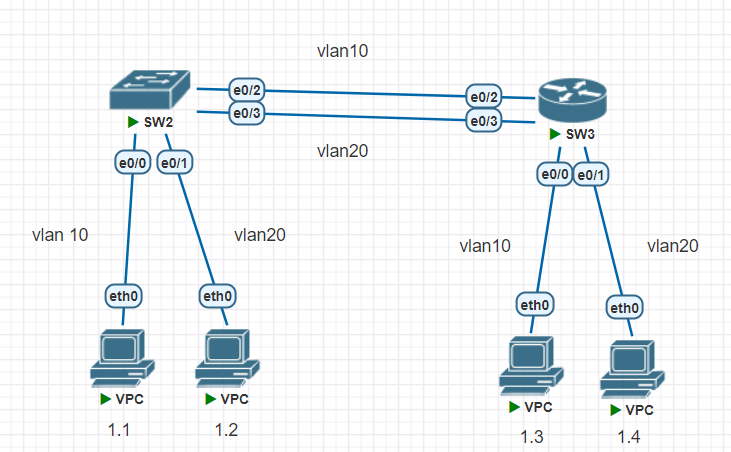
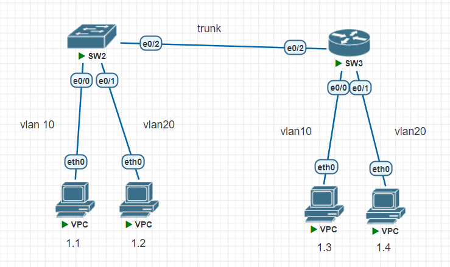
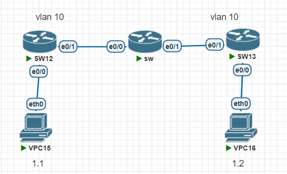

## vlan

預設所有節點都在`vlan1`  
建立`vlan10`、`vlan20`  
```
Switch(config)#vlan 10
Switch(config-vlan)#name vlan10
Switch(config-vlan)#vlan 20
Switch(config-vlan)#name vlan20
Switch(config-vlan)#do sh vlan

VLAN Name                             Status    Ports
---- -------------------------------- --------- -------------------------------
1    default                          active    Et0/0, Et0/1, Et0/2, Et0/3
10   vlan10                           active
20   vlan20                           active
1002 fddi-default                     act/unsup
1003 token-ring-default               act/unsup
1004 fddinet-default                  act/unsup
1005 trnet-default                    act/unsup

VLAN Type  SAID       MTU   Parent RingNo BridgeNo Stp  BrdgMode Trans1 Trans2
---- ----- ---------- ----- ------ ------ -------- ---- -------- ------ ------
1    enet  100001     1500  -      -      -        -    -        0      0
10   enet  100010     1500  -      -      -        -    -        0      0
20   enet  100020     1500  -      -      -        -    -        0      0
1002 fddi  101002     1500  -      -      -        -    -        0      0
1003 tr    101003     1500  -      -      -        -    -        0      0
1004 fdnet 101004     1500  -      -      -        ieee -        0      0
1005 trnet 101005     1500  -      -      -        ibm  -        0      0

Primary Secondary Type              Ports
------- --------- ----------------- ------------------------------------------
```
設定`e0/0`、`e0/1`在`vlan10`  
```
Switch(config)#int range e0/0-1
Switch(config-if-range)#switchport mode access
Switch(config-if-range)#switchport access vlan 10
Switch(config-if-range)#do sh vlan br

VLAN Name                             Status    Ports
---- -------------------------------- --------- -------------------------------
1    default                          active    Et0/2, Et0/3
10   vlan10                           active    Et0/0, Et0/1
20   vlan20                           active
1002 fddi-default                     act/unsup
1003 token-ring-default               act/unsup
1004 fddinet-default                  act/unsup
1005 trnet-default                    act/unsup
```
```
Switch(config-if-range)#int range e0/2-3
Switch(config-if-range)#switchport mode access
Switch(config-if-range)#switchport access vlan 20
Switch(config-if-range)#do sh vlan br

VLAN Name                             Status    Ports
---- -------------------------------- --------- -------------------------------
1    default                          active
10   vlan10                           active    Et0/0, Et0/1
20   vlan20                           active    Et0/2, Et0/3
1002 fddi-default                     act/unsup
1003 token-ring-default               act/unsup
1004 fddinet-default                  act/unsup
1005 trnet-default                    act/unsup
```
不同`vlan`的設備無法互聯  
```
VPCS> ip 192.168.1.1 255.255.255.0
Checking for duplicate address...
PC1 : 192.168.1.1 255.255.255.0

VPCS> ping 192.168.1.2

84 bytes from 192.168.1.2 icmp_seq=1 ttl=64 time=1.134 ms
84 bytes from 192.168.1.2 icmp_seq=2 ttl=64 time=1.293 ms
84 bytes from 192.168.1.2 icmp_seq=3 ttl=64 time=1.172 ms
84 bytes from 192.168.1.2 icmp_seq=4 ttl=64 time=1.372 ms
84 bytes from 192.168.1.2 icmp_seq=5 ttl=64 time=1.198 ms

VPCS> ping 192.168.1.3

host (192.168.1.3) not reachable
```

```
VPCS> ip 192.168.1.3 255.255.255.0
Checking for duplicate address...
PC1 : 192.168.1.3 255.255.255.0

VPCS> ping 192.168.1.2

host (192.168.1.2) not reachable

VPCS> ping 192.168.1.4

84 bytes from 192.168.1.4 icmp_seq=1 ttl=64 time=1.061 ms
84 bytes from 192.168.1.4 icmp_seq=2 ttl=64 time=1.033 ms
84 bytes from 192.168.1.4 icmp_seq=3 ttl=64 time=0.942 ms
84 bytes from 192.168.1.4 icmp_seq=4 ttl=64 time=1.039 ms
84 bytes from 192.168.1.4 icmp_seq=5 ttl=64 time=1.530 ms
```
## access link

兩台`switch`之間設定兩條分別給`vlan10`跟`vlan20`的通道  
```
Switch(config)#int range e0/0,e0/2
Switch(config-if-range)#switchport mode access
Switch(config-if-range)#switchport access vlan 10
Switch(config-if-range)#int range e0/1, e0/3
*Jan  1 13:20:06.548: %CDP-4-NATIVE_VLAN_MISMATCH: Native VLAN mismatch discovered on Ethernet0/2 (10), with Switch Ethernet0/2 (1).
Switch(config-if-range)#int range e0/1, e0/3
Switch(config-if-range)#switchport mode access
Switch(config-if-range)#switchport access vlan 20
```
```
VPCS> ping 192.168.1.2

192.168.1.2 icmp_seq=1 timeout
192.168.1.2 icmp_seq=2 timeout
192.168.1.2 icmp_seq=3 timeout
192.168.1.2 icmp_seq=4 timeout
192.168.1.2 icmp_seq=5 timeout

VPCS> ping 192.168.1.3

84 bytes from 192.168.1.3 icmp_seq=1 ttl=64 time=1.641 ms
84 bytes from 192.168.1.3 icmp_seq=2 ttl=64 time=1.688 ms
84 bytes from 192.168.1.3 icmp_seq=3 ttl=64 time=1.712 ms
84 bytes from 192.168.1.3 icmp_seq=4 ttl=64 time=1.540 ms
84 bytes from 192.168.1.3 icmp_seq=5 ttl=64 time=1.516 ms
```

## trunk
  
```
Switch(config)#int e0/2
Switch(config-if)#switchport trunk encapsulation dot1q
Switch(config-if)#switchport mode trunk
Switch(config-if)#do sh int trunk

Port        Mode             Encapsulation  Status        Native vlan
Et0/2       on               802.1q         trunking      1

Port        Vlans allowed on trunk
Et0/2       1-4094

Port        Vlans allowed and active in management domain
Et0/2       1,10,20

Port        Vlans in spanning tree forwarding state and not pruned
Et0/2       1,10,20
```
`vlan`一樣運作  
```
VPCS> ping 192.168.1.3

84 bytes from 192.168.1.3 icmp_seq=1 ttl=64 time=1.723 ms
84 bytes from 192.168.1.3 icmp_seq=2 ttl=64 time=2.048 ms
84 bytes from 192.168.1.3 icmp_seq=3 ttl=64 time=1.806 ms
84 bytes from 192.168.1.3 icmp_seq=4 ttl=64 time=1.377 ms
84 bytes from 192.168.1.3 icmp_seq=5 ttl=64 time=2.010 ms

VPCS> ping 192.168.1.4

host (192.168.1.4) not reachable
```

## trunk allow
只允許特定`vlan`可使用  
```
Switch(config-if)#int e0/2
Switch(config-if)#switchport trunk allowed vlan 1,10-19
```
`vlan1`的vpc可以連  
```  
VPCS> ping 192.168.1.3

84 bytes from 192.168.1.3 icmp_seq=1 ttl=64 time=1.516 ms
84 bytes from 192.168.1.3 icmp_seq=2 ttl=64 time=1.910 ms
84 bytes from 192.168.1.3 icmp_seq=3 ttl=64 time=1.323 ms
84 bytes from 192.168.1.3 icmp_seq=4 ttl=64 time=2.179 ms
84 bytes from 192.168.1.3 icmp_seq=5 ttl=64 time=1.781 ms
```
`vlan20`不行
```
VPCS> ping 192.168.1.4

host (192.168.1.4) not reachable
```


在中間的`sw`不設`vlan`的情況下  
兩邊的`vlan 10`無法相連  
```
VPCS> ping 192.168.1.2

host (192.168.1.2) not reachable
```
