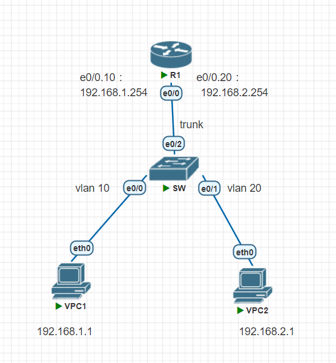

## DHCP helper


1. `DHCP Server`建立Pool10、Pool20  
```
Router(config)#hostname DHCPserver
DHCPserver(config)#int e0/0

DHCPserver(config-if)#ip addr 192.168.1.2 255.255.255.0
DHCPserver(config-if)#no shutdown
DHCPserver(config-if)#exit
DHCPserver(config)#ip dhcp pool Pool10
DHCPserver(dhcp-config)#network 192.168.10.0 255.255.255.0
DHCPserver(dhcp-config)#default-router 192.168.10.254
DHCPserver(dhcp-config)#dns-server 8.8.8.8
DHCPserver(dhcp-config)#exit
DHCPserver(config)#ip dhcp pool Pool20
DHCPserver(dhcp-config)#network 192.168.20.0 255.255.255.0
DHCPserver(dhcp-config)#default-router 192.168.20.254
DHCPserver(dhcp-config)#dns-server 8.8.8.8
```

2. `SWL2`建立vlan 10、20，e0/2設為`trunk`
```
Switch(config-vlan)#do sh vlan br

VLAN Name                             Status    Ports
---- -------------------------------- --------- -------------------------------
1    default                          active    Et0/0, Et0/1, Et0/2, Et0/3
10   VLAN0010                         active
20   VLAN0020                         active
1002 fddi-default                     act/unsup
1003 token-ring-default               act/unsup
1004 fddinet-default                  act/unsup
1005 trnet-default                    act/unsup
```

3. `R1`建立e0/0.10、e0/0.20
`helper-address`：設為`DHCP Server`
```
Router(config-if)#int e0/0.10
Router(config-subif)#encapsulation dot1Q 10
Router(config-subif)#ip addr 192.168.10.254 255.255.255.0
Router(config-subif)#no shutdown
Router(config-subif)#ip helper-address 12.1.1.2
R1(config)#int e0/0.20
R1(config-subif)#encapsulation dot1Q 20
R1(config-subif)#ip addr 192.168.20.254 255.255.255.0
R1(config-subif)#no shutdown
R1(config-subif)#ip helper-address 12.1.1.2

```
4. 在`DHCPserver`跟`R1`建立路由規則
```
DHCPserver(config)#router ospf 1
DHCPserver(config-router)#router-id 2.2.2.2
DHCPserver(config-router)#network 12.1.1.0 0.0.0.255 a 0
```
```
R1(config)#router ospf 1
R1(config-router)#router-id 1.1.1.1
R1(config-router)#network 12.1.1.0 0.0.0.255 a 0
R1(config-router)#network 192.168.10.0 0.0.0.255 a 0
R1(config-router)#network 192.168.20.0 0.0.0.255 a 0
```
5. 確認路由規則有建立
```
DHCPserver(config-router)#do sh ip route
Codes: L - local, C - connected, S - static, R - RIP, M - mobile, B - BGP
       D - EIGRP, EX - EIGRP external, O - OSPF, IA - OSPF inter area
       N1 - OSPF NSSA external type 1, N2 - OSPF NSSA external type 2
       E1 - OSPF external type 1, E2 - OSPF external type 2
       i - IS-IS, su - IS-IS summary, L1 - IS-IS level-1, L2 - IS-IS level-2
       ia - IS-IS inter area, * - candidate default, U - per-user static route
       o - ODR, P - periodic downloaded static route, H - NHRP, l - LISP
       + - replicated route, % - next hop override

Gateway of last resort is not set

      12.0.0.0/8 is variably subnetted, 2 subnets, 2 masks
C        12.1.1.0/24 is directly connected, Ethernet0/0
L        12.1.1.2/32 is directly connected, Ethernet0/0
O     192.168.10.0/24 [110/20] via 12.1.1.1, 00:00:20, Ethernet0/0
O     192.168.20.0/24 [110/20] via 12.1.1.1, 00:00:10, Ethernet0/0
```
6. 在`VPC`請求IP
```
VPCS> ip dhcp
DDORA IP 192.168.10.1/24 GW 192.168.10.254
```
```
VPCS> ip dhcp
DDORA IP 192.168.20.1/24 GW 192.168.20.254
```
## ssh 遠端管理
`sw3L`建立vlan 10 20 255
```
sw3l(config)#ip routing
sw3l(config)#int vlan 10
sw3l(config-if)#ip addr 192.168.10.254 255.255.255.0
sw3l(config-if)#no shutdown
sw3l(config-if)#int vlan 20
sw3l(config-if)#ip addr 192.168.20.254 255.255.255.0
sw3l(config-if)#no shutdown
sw3l(config)#int vlan 255
sw3l(config-if)#ip addr 192.168.255.254 255.255.255.0
sw3l(config-if)#no shutdown
sw3l(config-if)#do sh ip int br
Interface              IP-Address      OK? Method Status                Protocol
Ethernet0/0            unassigned      YES unset  up                    up
Ethernet0/1            12.1.1.1        YES manual up                    up
Ethernet0/2            unassigned      YES unset  up                    up
Ethernet0/3            unassigned      YES unset  up                    up
Vlan10                 192.168.10.254  YES manual up                    up
Vlan20                 192.168.20.254  YES manual up                    up
Vlan255                192.168.255.254 YES manual up 
```
`SW`也建立vlan 10 20 255
```
Switch(config-vlan)#do sh vlan br

VLAN Name                             Status    Ports
---- -------------------------------- --------- -------------------------------
1    default                          active    Et0/3
10   VLAN0010                         active    Et0/1
20   VLAN0020                         active    Et0/2
255  VLAN0255                         active
1002 fddi-default                     act/unsup
1003 token-ring-default               act/unsup
1004 fddinet-default                  act/unsup
1005 trnet-default                    act/unsup
```
進入vlan 255，設定ip 192.168.255.1
```
Switch(config-vlan)#int vlan 255
Switch(config-if)#ip addr 192.168.255.1 255.255.255.0
Switch(config-if)#no shutdown
Switch(config-if)#exit
Switch(config)#ip default-gateway 192.168.255.254
Switch(config-if)#do sh ip int br
Interface              IP-Address      OK? Method Status                Protocol
Ethernet0/0            unassigned      YES unset  up                    up
Ethernet0/1            unassigned      YES unset  up                    up
Ethernet0/2            unassigned      YES unset  up                    up
Ethernet0/3            unassigned      YES unset  up                    up
Vlan255                192.168.255.1   YES manual up                    up
```
在vpc上設定ip後，互ping
```
VPCS>  ip 192.168.20.1 255.255.255.0 192.168.20.254
```
```
VPCS> ip 192.168.10.1 255.255.255.0 192.168.10.254
VPCS> ping 192.168.20.254

84 bytes from 192.168.20.254 icmp_seq=1 ttl=255 time=1.631 ms
84 bytes from 192.168.20.254 icmp_seq=2 ttl=255 time=0.816 ms
84 bytes from 192.168.20.254 icmp_seq=3 ttl=255 time=0.876 ms
84 bytes from 192.168.20.254 icmp_seq=4 ttl=255 time=0.826 ms
84 bytes from 192.168.20.254 icmp_seq=5 ttl=255 time=0.920 ms

VPCS> ping 192.168.20.1

192.168.20.1 icmp_seq=1 timeout
84 bytes from 192.168.20.1 icmp_seq=2 ttl=63 time=2.514 ms
84 bytes from 192.168.20.1 icmp_seq=3 ttl=63 time=2.245 ms
84 bytes from 192.168.20.1 icmp_seq=4 ttl=63 time=2.261 ms
84 bytes from 192.168.20.1 icmp_seq=5 ttl=63 time=2.394 ms
```


## ssh
在`SW`跟`SW3L`開啟ssh
```
sw3l(config)#username cisco password cisco
sw3l(config)#ip domain-name test.com
sw3l(config)#crypto key generate rsa
The name for the keys will be: sw3l.test.com
Choose the size of the key modulus in the range of 360 to 4096 for your
  General Purpose Keys. Choosing a key modulus greater than 512 may take
  a few minutes.

How many bits in the modulus [512]: 1024
% Generating 1024 bit RSA keys, keys will be non-exportable...
[OK] (elapsed time was 0 seconds)

sw3l(config)#ip ssh version 2

sw3l(config)#line vty 0 4
sw3l(config-line)#login local
sw3l(config-line)#transport input ssh
```
```
Switch(config-line)#username cisco password cisco
Switch(config)#ip domain-name test.com
Switch(config)#crypto key generate rsa
The name for the keys will be: Switch.test.com
Choose the size of the key modulus in the range of 360 to 4096 for your
  General Purpose Keys. Choosing a key modulus greater than 512 may take
  a few minutes.

How many bits in the modulus [512]: 1024
% Generating 1024 bit RSA keys, keys will be non-exportable...
[OK] (elapsed time was 0 seconds)
Switch(config)#ip ssh version 2
Switch(config)#line vty 0 4
Switch(config-line)#login local
Switch(config-line)#transport input ssh
```
設定`SW3L`跟`R10`的連線規則
```
sw3l(config-line)#int e0/1
sw3l(config-if)#no switchport
sw3l(config-if)#ip addr 12.1.1.1 255.255.255.0
sw3l(config-if)#no shutdown
sw3l(config-if)#exit
sw3l(config)#router ospf 1
sw3l(config-router)#router-id 1.1.1.1
sw3l(config-router)#network 12.1.1.0 0.0.0.255 a 0
sw3l(config-router)#network 192.168.10.0 0.0.0.255 a 0
sw3l(config-router)#network 192.168.20.0 0.0.0.255 a 0
sw3l(config-router)#network 192.168.255.0 0.0.0.255 a 0
```
`Router`設定ip和路由規則
```
Router(config)#hostname R10
R10(config)#int e0/0
R10(config-if)#ip addr 12.1.1.2 255.255.255.0
R10(config-if)#no sh
R10(config-if)#no shutdown
R10(config-if)#exit
R10(config)#router ospf 1
R10(config-router)#router-id 2.2.2.2
R10(config-router)#network 12.1.1.0 0.0.0.255 a 0
```
從`R10`用ssh連到`SW3L`
```
R10(config)#do ping 192.168.255.254
Type escape sequence to abort.
Sending 5, 100-byte ICMP Echos to 192.168.255.254, timeout is 2 seconds:
!!!!!
Success rate is 100 percent (5/5), round-trip min/avg/max = 1/1/1 ms

R10#ssh -l cisco 192.168.255.254
Password:

sw3l>
```
在`sw`設定內定路由，確認能連到外面
```
Switch(config)#ip route 0.0.0.0 0.0.0.0 192.168.255.254
Switch(config)#do sh ip route
Codes: L - local, C - connected, S - static, R - RIP, M - mobile, B - BGP
       D - EIGRP, EX - EIGRP external, O - OSPF, IA - OSPF inter area
       N1 - OSPF NSSA external type 1, N2 - OSPF NSSA external type 2
       E1 - OSPF external type 1, E2 - OSPF external type 2
       i - IS-IS, su - IS-IS summary, L1 - IS-IS level-1, L2 - IS-IS level-2
       ia - IS-IS inter area, * - candidate default, U - per-user static route
       o - ODR, P - periodic downloaded static route, H - NHRP, l - LISP
       + - replicated route, % - next hop override

Gateway of last resort is 192.168.255.254 to network 0.0.0.0

S*    0.0.0.0/0 [1/0] via 192.168.255.254
      192.168.255.0/24 is variably subnetted, 2 subnets, 2 masks
C        192.168.255.0/24 is directly connected, Vlan255
L        192.168.255.1/32 is directly connected, Vlan255
Switch(config)#do ping 192.168.255.254
Type escape sequence to abort.
Sending 5, 100-byte ICMP Echos to 192.168.255.254, timeout is 2 seconds:
!!!!!
Success rate is 100 percent (5/5), round-trip min/avg/max = 1/1/1 ms
Switch(config)#do ping 12.1.1.1
Type escape sequence to abort.
Sending 5, 100-byte ICMP Echos to 12.1.1.1, timeout is 2 seconds:
!!!!!
Success rate is 100 percent (5/5), round-trip min/avg/max = 1/1/1 ms
Switch(config)#do ping 12.1.1.2
Type escape sequence to abort.
Sending 5, 100-byte ICMP Echos to 12.1.1.2, timeout is 2 seconds:
!!!!!
Success rate is 100 percent (5/5), round-trip min/avg/max = 1/1/2 ms
```
從`R10`用ssh連到`SW`
```
R10#ssh -l cisco 192.168.255.1
Password:

Switch>
```