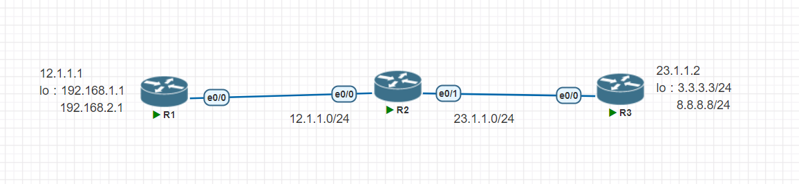

## Firewall(Packet-Lavel)

## Cisco ACL
[參考網站](https://blog.xuite.net/tolarku/blog/38160949-%5BCCNA%5D+Cisco+Router+%E5%AD%98%E5%8F%96%E6%8E%A7%E5%88%B6+-+ACL+-+Standard#:~:text=%E5%9C%A8Cisco%20%E7%9A%84switch%20%2F%20Router,%E6%9C%89ACL%E7%9A%84%E6%8E%A7%E5%88%B6%E5%8A%9F%E8%83%BD%E3%80%82)  
## 配置圖

## 標準ACL
1. 設定ip
2. 設定路由規則
```
R1(config)#router ospf 1
R1(config-router)#router-id 1.1.1.1
R1(config-router)#network 192.168.1.0 0.0.0.255 a 0
R1(config-router)#network 192.168.2.0 0.0.0.255 a 0
R1(config-router)#network 12.1.1.0 0.0.0.255 a 0
```
```
R2(config)#router ospf 1
R2(config-router)#router-id 2.2.2.2
R2(config-router)#network 12.1.1.0 0.0.0.255 a 0
*Dec 27 13:32:59.285: %OSPF-5-ADJCHG: Process 1, Nbr 1.1.1.1 on Ethernet0/0 from LOADING to FULL, Loading Done
R2(config-router)#network 23.1.1.0 0.0.0.255 a 0
```
```
R3(config)#router ospf 1
R3(config-router)#router-id 3.3.3.3
R3(config-router)#network 23.1.1.0 0.0.0.255 a 0
R3(config-router)#network 3.3.3.3 0.0.0.0 a 0
R3(config-router)#network 8.8.8.8 0.0.0.0 a 0
```
3. 確認規則都設好
```
R1(config-router)#do sh ip route
Codes: L - local, C - connected, S - static, R - RIP, M - mobile, B - BGP
       D - EIGRP, EX - EIGRP external, O - OSPF, IA - OSPF inter area
       N1 - OSPF NSSA external type 1, N2 - OSPF NSSA external type 2
       E1 - OSPF external type 1, E2 - OSPF external type 2
       i - IS-IS, su - IS-IS summary, L1 - IS-IS level-1, L2 - IS-IS level-2
       ia - IS-IS inter area, * - candidate default, U - per-user static route
       o - ODR, P - periodic downloaded static route, H - NHRP, l - LISP
       + - replicated route, % - next hop override

Gateway of last resort is not set

      3.0.0.0/32 is subnetted, 1 subnets
O        3.3.3.3 [110/21] via 12.1.1.2, 00:04:03, Ethernet0/0
      8.0.0.0/32 is subnetted, 1 subnets
O        8.8.8.8 [110/21] via 12.1.1.2, 00:04:03, Ethernet0/0
      12.0.0.0/8 is variably subnetted, 2 subnets, 2 masks
C        12.1.1.0/24 is directly connected, Ethernet0/0
L        12.1.1.1/32 is directly connected, Ethernet0/0
      23.0.0.0/24 is subnetted, 1 subnets
O        23.1.1.0 [110/20] via 12.1.1.2, 00:04:13, Ethernet0/0
      192.168.1.0/24 is variably subnetted, 2 subnets, 2 masks
C        192.168.1.0/24 is directly connected, Loopback1
L        192.168.1.1/32 is directly connected, Loopback1
      192.168.2.0/24 is variably subnetted, 2 subnets, 2 masks
C        192.168.2.0/24 is directly connected, Loopback2
L        192.168.2.1/32 is directly connected, Loopback2
```
4. 確認連通
```
R1(config-router)#do ping 8.8.8.8 source 12.1.1.1
Type escape sequence to abort.
Sending 5, 100-byte ICMP Echos to 8.8.8.8, timeout is 2 seconds:
Packet sent with a source address of 12.1.1.1
!!!!!
Success rate is 100 percent (5/5), round-trip min/avg/max = 1/1/2 ms
R1(config-router)#do ping 8.8.8.8 source 192.168.1.1
Type escape sequence to abort.
Sending 5, 100-byte ICMP Echos to 8.8.8.8, timeout is 2 seconds:
Packet sent with a source address of 192.168.1.1
!!!!!
Success rate is 100 percent (5/5), round-trip min/avg/max = 1/1/2 ms
```

5. 設定`192.168.1.x`在`R2`會被擋下
順序由小到大，小的會優先生效
```
R2(config)#access-list 1 deny 192.168.1.0 0.0.0.255
R2(config)#access-list 1 permit any
R2(config)#do sh access-lists
Standard IP access list 1
    10 deny   192.168.1.0, wildcard bits 0.0.0.255
    20 permit any
```

6. 設定流量進入e0/0時套用規則
```
R2(config)#int e0/0
R2(config-if)#ip access-group 1 in
```
7. 再嘗試ping 8.8.8.8，192.168.1.1會被擋下
```
R1(config-router)#do ping 8.8.8.8 source 12.1.1.1
Type escape sequence to abort.
Sending 5, 100-byte ICMP Echos to 8.8.8.8, timeout is 2 seconds:
Packet sent with a source address of 12.1.1.1
!!!!!
Success rate is 100 percent (5/5), round-trip min/avg/max = 1/1/2 ms
R1(config-router)#do ping 8.8.8.8 source 192.168.1.1
Type escape sequence to abort.
Sending 5, 100-byte ICMP Echos to 8.8.8.8, timeout is 2 seconds:
Packet sent with a source address of 192.168.1.1
U.U.U
Success rate is 0 percent (0/5)
```
開啟`R2`ssh連線
```
R2(config)#username cisco password cisco
R2(config)#ip domain-n test.com
R2(config)#ip domain-name test.com
R2(config)#crypto key generate rsa
The name for the keys will be: R2.test.com
Choose the size of the key modulus in the range of 360 to 4096 for your
  General Purpose Keys. Choosing a key modulus greater than 512 may take
  a few minutes.

How many bits in the modulus [512]: 1024
% Generating 1024 bit RSA keys, keys will be non-exportable...
[OK] (elapsed time was 0 seconds)

R2(config)#ip ssh version 2
R2(config)#line vty 0 4
R2(config-line)#login local
R2(config-line)#transport input ssh
```
設定規則2，只允許`12.1.1.1`連線
```
R2(config)#access-list 2 permit host 12.1.1.1
R2(config)#access-list 2 deny any
R2(config)#do sh access-lists
Standard IP access list 1
    10 deny   192.168.1.0, wildcard bits 0.0.0.255 (8 matches)
    20 permit any (152 matches)
Standard IP access list 2
    10 permit 12.1.1.1
    20 deny   any
R2(config)#line vty 0 4
R2(config-line)#acc
R2(config-line)#access-class 2 in
```
從`R1`可以連線
```
[Connection to 12.1.1.2 closed by foreign host]
R1#ssh -l cisco 12.1.1.2
Password:
R2>exit
```
從`R3`會被擋掉
```
R3#ssh -l cisco 23.1.1.2
% Connection refused by remote host
```

## 延伸ACL
可針對port和number處理
1. 先取消剛才套用的規則
```
R2(config-line)#int e0/0
R2(config-if)#no ip access-group 1 in
R2(config-if)#line vty 0 4
R2(config-line)#no access-class 2 in
```
2. 設定規則，從12.1.1.1能ping 3.3.3.3，不能ping 8.8.8.8

```
R2(config)#access-list 101 permit icmp 192.168.1.0 0.0.0.255 host 3.3.3.3
R2(config)#access-list 101 deny icmp 192.168.1.0 0.0.0.255 host 8.8.8.8
R2(config)#do sh access-list 101
Extended IP access list 101
    10 permit icmp 192.168.1.0 0.0.0.255 host 3.3.3.3
    20 deny icmp 192.168.1.0 0.0.0.255 host 8.8.8.8
```
測試`ping 3.3.3.3`和`ping 8.8.8.8`
```
R1#ping 3.3.3.3 source 192.168.1.1
Type escape sequence to abort.
Sending 5, 100-byte ICMP Echos to 3.3.3.3, timeout is 2 seconds:
Packet sent with a source address of 192.168.1.1
!!!!!
Success rate is 100 percent (5/5), round-trip min/avg/max = 1/1/2 ms
R1#ping 8.8.8.8 source 192.168.1.1
Type escape sequence to abort.
Sending 5, 100-byte ICMP Echos to 8.8.8.8, timeout is 2 seconds:
Packet sent with a source address of 192.168.1.1
U.U.U
Success rate is 0 percent (0/5)
```
3. 命名式規則
建立一個`rule1.0`
```
R2(config-if)#ip access-list extended rule1.0
R2(config-ext-nacl)#permit icmp 192.168.1.0 0.0.0.255 host 3.3.3.3
R2(config-ext-nacl)#deny icmp 192.168.1.0 0.0.0.255 host 8.8.8.8
R2(config-ext-nacl)#exit
R2(config)#do sh ip access
R2(config)#do sh ip access-lists rule1.0
Extended IP access list rule1.0
    10 permit icmp 192.168.1.0 0.0.0.255 host 3.3.3.3
    20 deny icmp 192.168.1.0 0.0.0.255 host 8.8.8.8
```
插入規則，在設定規則時加入編號
```
R2(config-if)#do sh ip access-list rule1.0
Extended IP access list rule1.0
    10 permit icmp 192.168.1.0 0.0.0.255 host 3.3.3.3 (5 matches)
    20 deny icmp 192.168.1.0 0.0.0.255 host 8.8.8.8 (5 matches)
R2(config-if)#ip access-list extended rule1.0
R2(config-ext-nacl)#15 permit icmp 192.168.1.0 0.0.0.255 host 6.6.6.6
R2(config-ext-nacl)#exit
R2(config)#do sh ip access-list rule1.0
Extended IP access list rule1.0
    10 permit icmp 192.168.1.0 0.0.0.255 host 3.3.3.3 (5 matches)
    15 permit icmp 192.168.1.0 0.0.0.255 host 6.6.6.6
    20 deny icmp 192.168.1.0 0.0.0.255 host 8.8.8.8 (5 matches)
```
## S(Source)NAT
俗稱NAT，又作NAPT，改變來源位置
1. 建立`nat pool`
```
R2(config)#access-list 10 permit 192.168.1.0 0.0.0.255
R2(config)#ip nat pool DNATPOOL 23.1.1.100 23.1.1.200 netmask 255.255.255.0
R2(config)#int e0/0
R2(config-if)#ip nat inside
R2(config-if)#int e0/1
R2(config-if)#ip nat outside
R2(config-if)#exit
R2(config)#ip nat inside source list 10 pool DNATPOOL
```

## D(Destination)AT
(port-forwarding)


## 命名ACL
設定路由規則

